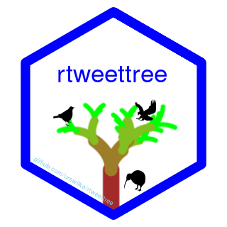

<!-- README.md is generated from README.Rmd. Please edit that file -->
<!-- The logo was created in the repo https://github.com/urswilke/rtweettree_hex -->

# rtweettree 

<!-- badges: start -->

[](https://github.com/urswilke/rtweettree/actions)
[](https://codecov.io/gh/urswilke/rtweettree?branch=master)
[](https://lifecycle.r-lib.org/articles/stages.html#experimental)
<!-- badges: end -->

The goal of rtweettree is to recursively scrape a twitter tweet and all
replies, quotes, retweets and likes (that the API provides, see
[here](https://community.rstudio.com/t/rtweet-package-extract-specific-tweets-from-specific-user/45206/2))
and visualize them in a network graph. The functionalities to scrape
twitter data are heavily based on the excellent
[**rtweet**](https://github.com/ropensci/rtweet) package. The graph
network manipulation functionalities rely on the amazing
[**tidygraph**](https://github.com/thomasp85/tidygraph) package and are
visualized with [**ggraph**](https://github.com/thomasp85/ggraph).

## Responsible use

**rtweettree** should be used in strict accordance with Twitter’s
[developer
terms](https://developer.twitter.com/en/developer-terms/more-on-restricted-use-cases).

## Installation

To get the current development version from Github (with the
[remotes](https://github.com/r-lib/remotes) package):

``` r
## install dev version of rtweettree from github
remotes::install_github("UrsWilke/rtweettree")
```

## Usage

In order to use **rtweettree** please refer to [the according section of
**rtweet**](https://github.com/ropensci/rtweet#usage). It is probably
good advice to first feel comfortable with
[**rtweet**](https://github.com/ropensci/rtweet).

## Quick dive-in

First we’ll load the package.

``` r
library(rtweettree)
```

To give you a quick understanding of the functionalities of this
package, it can be used to scrape data related to a twitter status id
`main_status_id` and all the replies (to replies), quotes, retweets and
likes the API provides using `rtweet` functions under the hood. The
status id is the last number in the url of every tweet on twitter.

``` r
main_status_id <- "1438481824922181635"
l <- rtweettree_data(main_status_id)
```

This results in a named list of rtweet dataframes:

``` r
l
#> # A tibble: 12 × 93
#>    type        user_id  status_id  created_at          screen_name text   source
#>  * <chr>       <chr>    <chr>      <dttm>              <chr>       <chr>  <chr> 
#>  1 main_status 1438476… 143848182… 2021-09-16 12:36:07 rtweetbird1 this … Twitt…
#>  2 tree        1438480… 143848428… 2021-09-16 12:45:55 rtweetbird3 this … Twitt…
#>  3 tls         1438480… 143848428… 2021-09-16 12:45:55 rtweetbird3 this … Twitt…
#>  4 tls         1438480… 143848356… 2021-09-16 12:43:01 rtweetbird3 @rtwe… Twitt…
#>  5 tls         1438480… 143848345… 2021-09-16 12:42:36 rtweetbird3 @rtwe… Twitt…
#>  6 like        1438480… 143848428… 2021-09-16 12:45:55 rtweetbird3 this … Twitt…
#>  7 like        1438480… 143848356… 2021-09-16 12:43:01 rtweetbird3 @rtwe… Twitt…
#>  8 like        1438480… 143848345… 2021-09-16 12:42:36 rtweetbird3 @rtwe… Twitt…
#>  9 like        1438479… 143848243… 2021-09-16 12:38:32 rtweetbird2 @rtwe… Twitt…
#> 10 like        1438479… 143848230… 2021-09-16 12:38:02 rtweetbird2 @rtwe… Twitt…
#> 11 like        1438479… 143848243… 2021-09-16 12:38:32 rtweetbird2 @rtwe… Twitt…
#> 12 retweet     1438479… 143848258… 2021-09-16 12:39:09 rtweetbird2 this … Twitt…
#> # … with 86 more variables: display_text_width <dbl>, reply_to_status_id <chr>,
#> #   reply_to_user_id <chr>, reply_to_screen_name <chr>, is_quote <lgl>,
#> #   is_retweet <lgl>, favorite_count <int>, retweet_count <int>,
#> #   quote_count <int>, reply_count <int>, hashtags <list>, symbols <list>,
#> #   urls_url <list>, urls_t.co <list>, urls_expanded_url <list>,
#> #   media_url <list>, media_t.co <list>, media_expanded_url <list>,
#> #   media_type <list>, ext_media_url <list>, ext_media_t.co <list>, …
```

You can then visualize this data with:

``` r
autoplot(l)
```


Under the hood, the scraped data is first transformed into a
`tidygraph::tbl_graph()`

``` r
g <- rtweettree_tbl_graph(l)
g
#> # A tbl_graph: 9 nodes and 18 edges
#> #
#> # A directed acyclic simple graph with 1 component
#> #
#> # Node Data: 9 × 8 (active)
#>   name                type  screen_name url     data   text   label  profile_pic
#>   <chr>               <chr> <chr>       <glue>  <list> <chr>  <chr>  <list>     
#> 1 1438476950746636291 user  rtweetbird1 https:… <tibb… <NA>   rtwee… <magck-mg> 
#> 2 1438480252003569671 user  rtweetbird3 https:… <tibb… <NA>   rtwee… <magck-mg> 
#> 3 1438479415550390275 user  rtweetbird2 https:… <tibb… <NA>   rtwee… <magck-mg> 
#> 4 1438481824922181635 tweet <NA>        https:… <tibb… this … this … <NULL>     
#> 5 1438483457697591297 tweet <NA>        https:… <tibb… @rtwe… @rtwe… <NULL>     
#> 6 1438482432030818307 tweet <NA>        https:… <tibb… @rtwe… @rtwe… <NULL>     
#> # … with 3 more rows
#> #
#> # Edge Data: 18 × 5
#>    from    to user_id             screen_name type 
#>   <int> <int> <chr>               <chr>       <chr>
#> 1     4     5 1438480252003569671 rtweetbird3 reply
#> 2     4     6 1438479415550390275 rtweetbird2 reply
#> 3     4     7 1438479415550390275 rtweetbird2 reply
#> # … with 15 more rows
```

which is then visualized with ggraph.

A more in-depth example how to create the subtweet network graph from a
tweet `status_id` is shown in the `vignette("get_started")`.

## TODOs:

-   clean up code and refactor
-   make plotting functions more customizable

## Getting help

If you encounter a bug, please file an issue with a minimal reproducible
example on [GitHub](https://github.com/urswilke/rtweettree/issues).
