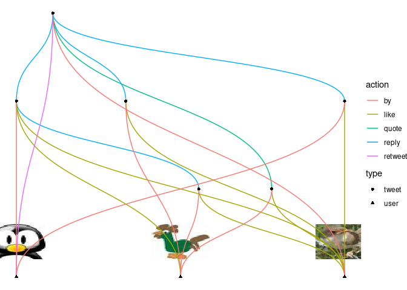

<!-- README.md is generated from README.Rmd. Please edit that file -->

# rtweettree

<!-- badges: start -->

[](https://github.com/urswilke/rtweettree/actions)
[](https://codecov.io/gh/urswilke/rtweettree?branch=master)
[](https://lifecycle.r-lib.org/articles/stages.html#experimental)
<!-- badges: end -->

The goal of rtweettree is to recursively scrape a twitter tweet and all
replies, quotes, retweets and likes (that the API provides, see
[here](https://community.rstudio.com/t/rtweet-package-extract-specific-tweets-from-specific-user/45206/2))
and visualize them in a network graph. The functionalities to scrape
twitter data are heavily based on the excellent
[**rtweet**](https://github.com/ropensci/rtweet) package. The graph
network manipulation functionalities rely on the amazing
[**tidygraph**](https://github.com/thomasp85/tidygraph) package and are
visualized with [**ggraph**](https://github.com/thomasp85/ggraph).

## Responsible use

**rtweettree** should be used in strict accordance with Twitter’s
[developer
terms](https://developer.twitter.com/en/developer-terms/more-on-restricted-use-cases).

## Installation

To get the current development version from Github (with the
[remotes](https://github.com/r-lib/remotes) package):

``` r
## install dev version of rtweettree from github
remotes::install_github("UrsWilke/rtweettree")
```

## load rtweettree package

``` r
library(rtweettree)
```

## Usage

In order to use **rtweettree** please refer to [the according section of
**rtweet**](https://github.com/ropensci/rtweet#usage). It is probably
good advice to first feel comfortable with
[**rtweet**](https://github.com/ropensci/rtweet).

## Quick dive-in

To give you a quick understanding of the functionalities of this
package, it can be used to scrape data related to a twitter status id
`main_status_id` and all the replies (to replies), quotes, retweets and
likes the API provides using `rtweet` functions under the hood. The
status id is the last number in the url of every tweet on twitter.

``` r
main_status_id <- "1438481824922181635"
l <- rtweettree_data(main_status_id)
```

This results in a named list of rtweet dataframes:

``` r
l
#> $df_main_status
#> # A tibble: 1 × 90
#>   user_id             status_id  created_at          screen_name text     source
#>   <chr>               <chr>      <dttm>              <chr>       <chr>    <chr> 
#> 1 1438476950746636291 143848182… 2021-09-16 12:36:07 rtweetbird1 this is… Twitt…
#> # … with 84 more variables: display_text_width <dbl>, reply_to_status_id <lgl>,
#> #   reply_to_user_id <lgl>, reply_to_screen_name <lgl>, is_quote <lgl>,
#> #   is_retweet <lgl>, favorite_count <int>, retweet_count <int>,
#> #   quote_count <int>, reply_count <int>, hashtags <list>, symbols <list>,
#> #   urls_url <list>, urls_t.co <list>, urls_expanded_url <list>,
#> #   media_url <list>, media_t.co <list>, media_expanded_url <list>,
#> #   media_type <list>, ext_media_url <list>, ext_media_t.co <list>, …
#> 
#> $df_tree
#> # A tibble: 1 × 91
#>   user_id             status_id  created_at          screen_name text     source
#>   <chr>               <chr>      <dttm>              <chr>       <chr>    <chr> 
#> 1 1438480252003569671 143848428… 2021-09-16 12:45:55 rtweetbird3 this is… Twitt…
#> # … with 85 more variables: display_text_width <dbl>, reply_to_status_id <chr>,
#> #   reply_to_user_id <chr>, reply_to_screen_name <chr>, is_quote <lgl>,
#> #   is_retweet <lgl>, favorite_count <int>, retweet_count <int>,
#> #   quote_count <int>, reply_count <int>, hashtags <list>, symbols <list>,
#> #   urls_url <list>, urls_t.co <list>, urls_expanded_url <list>,
#> #   media_url <list>, media_t.co <list>, media_expanded_url <list>,
#> #   media_type <list>, ext_media_url <list>, ext_media_t.co <list>, …
#> 
#> $df_tls
#> # A tibble: 3 × 90
#>   user_id             status_id  created_at          screen_name text     source
#>   <chr>               <chr>      <dttm>              <chr>       <chr>    <chr> 
#> 1 1438480252003569671 143848428… 2021-09-16 12:45:55 rtweetbird3 this is… Twitt…
#> 2 1438480252003569671 143848356… 2021-09-16 12:43:01 rtweetbird3 @rtweet… Twitt…
#> 3 1438480252003569671 143848345… 2021-09-16 12:42:36 rtweetbird3 @rtweet… Twitt…
#> # … with 84 more variables: display_text_width <dbl>, reply_to_status_id <chr>,
#> #   reply_to_user_id <chr>, reply_to_screen_name <chr>, is_quote <lgl>,
#> #   is_retweet <lgl>, favorite_count <int>, retweet_count <int>,
#> #   quote_count <int>, reply_count <int>, hashtags <list>, symbols <list>,
#> #   urls_url <list>, urls_t.co <list>, urls_expanded_url <list>,
#> #   media_url <list>, media_t.co <list>, media_expanded_url <list>,
#> #   media_type <list>, ext_media_url <list>, ext_media_t.co <list>, …
#> 
#> $df_favs
#> # A tibble: 6 × 91
#>   user_id             status_id  created_at          screen_name text     source
#> * <chr>               <chr>      <dttm>              <chr>       <chr>    <chr> 
#> 1 1438480252003569671 143848428… 2021-09-16 12:45:55 rtweetbird3 this is… Twitt…
#> 2 1438480252003569671 143848356… 2021-09-16 12:43:01 rtweetbird3 @rtweet… Twitt…
#> 3 1438480252003569671 143848345… 2021-09-16 12:42:36 rtweetbird3 @rtweet… Twitt…
#> 4 1438479415550390275 143848243… 2021-09-16 12:38:32 rtweetbird2 @rtweet… Twitt…
#> 5 1438479415550390275 143848230… 2021-09-16 12:38:02 rtweetbird2 @rtweet… Twitt…
#> 6 1438479415550390275 143848243… 2021-09-16 12:38:32 rtweetbird2 @rtweet… Twitt…
#> # … with 85 more variables: display_text_width <dbl>, reply_to_status_id <chr>,
#> #   reply_to_user_id <chr>, reply_to_screen_name <chr>, is_quote <lgl>,
#> #   is_retweet <lgl>, favorite_count <int>, retweet_count <int>,
#> #   quote_count <int>, reply_count <int>, hashtags <list>, symbols <list>,
#> #   urls_url <list>, urls_t.co <list>, urls_expanded_url <list>,
#> #   media_url <list>, media_t.co <list>, media_expanded_url <list>,
#> #   media_type <list>, ext_media_url <list>, ext_media_t.co <list>, …
#> 
#> $df_retweets
#> # A tibble: 1 × 90
#>   user_id             status_id  created_at          screen_name text     source
#>   <chr>               <chr>      <dttm>              <chr>       <chr>    <chr> 
#> 1 1438479415550390275 143848258… 2021-09-16 12:39:09 rtweetbird2 this is… Twitt…
#> # … with 84 more variables: display_text_width <int>, reply_to_status_id <lgl>,
#> #   reply_to_user_id <lgl>, reply_to_screen_name <lgl>, is_quote <lgl>,
#> #   is_retweet <lgl>, favorite_count <int>, retweet_count <int>,
#> #   quote_count <int>, reply_count <int>, hashtags <list>, symbols <list>,
#> #   urls_url <list>, urls_t.co <list>, urls_expanded_url <list>,
#> #   media_url <list>, media_t.co <list>, media_expanded_url <list>,
#> #   media_type <list>, ext_media_url <list>, ext_media_t.co <list>, …
#> 
#> attr(,"class")
#> [1] "rtweettree_data" "list"
```

You can then visualize this data with:

``` r
ggplot2::autoplot(l)
```



Under the hood, the scraped data is first transformed into a
`tidygraph::tbl_graph()`

``` r
g <- rtweettree_tbl_graph(l)
g
#> # A tbl_graph: 9 nodes and 19 edges
#> #
#> # A directed acyclic multigraph with 1 component
#> #
#> # Node Data: 9 × 6 (active)
#>   name                type  screen_name url           text          label       
#>   <chr>               <chr> <chr>       <glue>        <chr>         <chr>       
#> 1 1438476950746636291 user  rtweetbird1 https://twit… <NA>          rtweetbird1 
#> 2 1438480252003569671 user  rtweetbird3 https://twit… <NA>          rtweetbird3 
#> 3 1438479415550390275 user  rtweetbird2 https://twit… <NA>          rtweetbird2 
#> 4 1438481824922181635 tweet rtweetbird1 https://twit… this is a te… this is a t…
#> 5 1438483457697591297 tweet rtweetbird3 https://twit… @rtweetbird1… @rtweetbird…
#> 6 1438482432030818307 tweet rtweetbird2 https://twit… @rtweetbird1… @rtweetbird…
#> # … with 3 more rows
#> #
#> # Edge Data: 19 × 5
#>    from    to user_id             screen_name type 
#>   <int> <int> <chr>               <chr>       <chr>
#> 1     4     5 1438480252003569671 rtweetbird3 reply
#> 2     4     6 1438479415550390275 rtweetbird2 reply
#> 3     4     7 1438479415550390275 rtweetbird2 reply
#> # … with 16 more rows
```

which is then visualized with ggraph.

A more in-depth example how to create the subtweet network graph from a
tweet status\_id is shown in the [vignette for tree
visualization](articles/visualize_tree.html).

``` r
vignette("visualize_tree", package = "rtweettree")
```

## TODOs:

-   also capture the likes of the original tweet at the root of the tree
-   clean up code and refactor
-   make plotting functions more customizable
